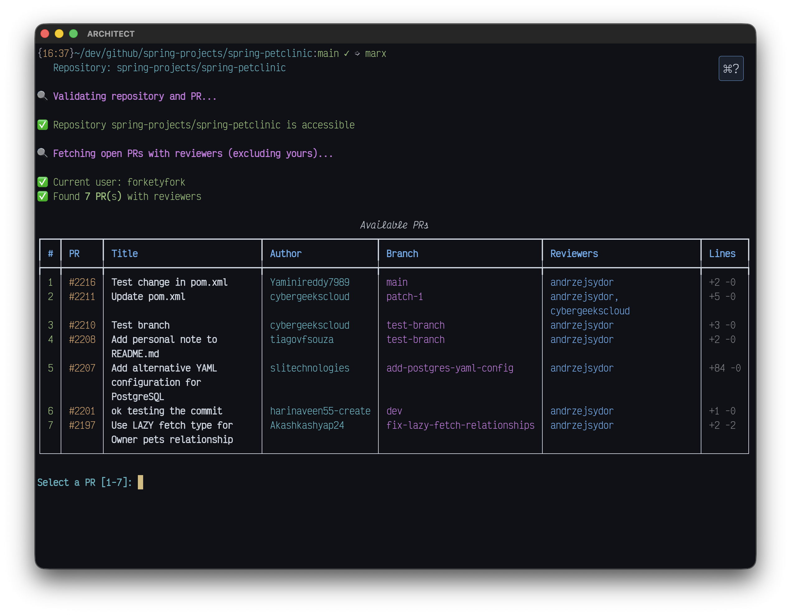
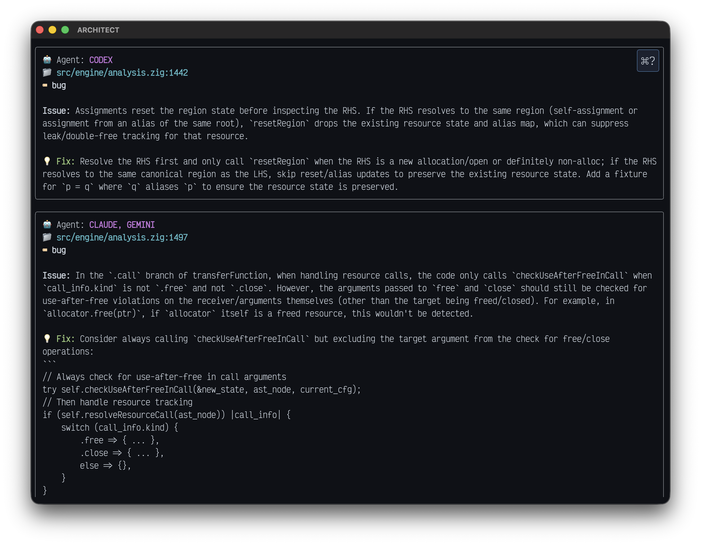

# MARX - Multi-Agentic Review eXperience

[](https://github.com/forketyfork/marx/actions/workflows/build.yml)
[](LICENSE)
[](https://www.python.org/)

Marx spins up multiple AI agents in Docker containers, each reviewing your PR independently. It merges their findings, removes duplicates, and gives you a pending GitHub review you can edit before submitting.

## Screenshots

<p> </p>

## Features

- Parallel multi-agent reviews with automatic deduplication
- YOLO-mode agents run in Docker with review tools and PR context
- Create a pending GitHub review from merged issues (edit before submit)
- Structured review outputs with a merged summary
- Interactive PR selection (excludes your own PRs and PRs assigned to you)
- Works with local CLI configs or API keys (config dirs are mounted into containers)
- JSON output for automation via `--json-output`

## Prerequisites

- `git`
- [gh](https://cli.github.com/) (authenticated)
- `docker`

## Install

```bash
uv tool install marx-ai
```

Need Nix or a source install? See [Installation](docs/installation.md).

## Configure

Create `~/.marx` with your GitHub token and any agent keys you want to use:

```bash
cat > ~/.marx <<'MARX'
GITHUB_TOKEN=ghp_your_token_here
ANTHROPIC_API_KEY=your_claude_key
OPENAI_API_KEY=your_openai_key
GEMINI_API_KEY=your_gemini_key
MARX
```

If you already use the agent CLIs locally, Marx copies `~/.claude`, `~/.codex`, and `~/.gemini`
into the containers so those configs work there too. API keys are optional.
See [Configuration](docs/configuration.md) for details.

## Use

```bash
# Interactive PR selection
marx

# Review a specific PR with all agents
marx --pr 123 --agents claude,codex,gemini

# Machine-readable output
marx --pr 123 --json-output
```

## Docs

- [Installation](docs/installation.md)
- [Configuration](docs/configuration.md)
- [Usage](docs/usage.md)
- [How It Works](docs/how-it-works.md)
- [Troubleshooting](docs/troubleshooting.md)
- [Development](docs/development.md)
- [Publishing](docs/publishing.md)
- [Contributing](docs/contributing.md)
